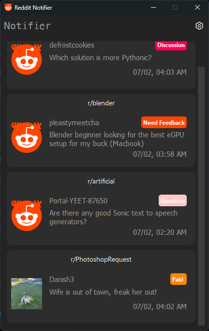
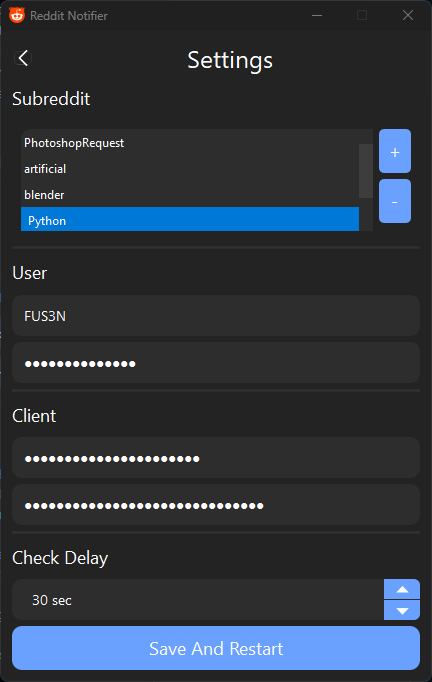

# A Very Simple Notifier App for Reddit
a simple GUI app for reddit that notifies you in your pc when a new post is made on your selected subreddits. Originally made for `PhotoshopRequests` but can be used with any subreddit (multiple).
This was made for personal use so some stuff might not be what you expect but wanted to share it here anyway.

    
    

## How it works
The app will require you to provide your reddit username and password and bot client ID and client secret, [How to get client ID and client secret](https://medium.com/@flincode/create-a-reddit-post-notifier-in-python-fb43a805474a) this article was made as a text tutorial on how to make a simpler version of this app but at the beginning it shows how to get all the necessary things including id and client you should follow it to get yours.

### Requirements
- praw
- httpx
- requests
- PySide6 (GUI)

## How to use

Opening it for the first time will ask you to configure just click ok and in the settings page, just add subreddits with plus icon at the top right, put your subreddit name without the "r/" part, just the name e.g. "AskReddit".  

After setting your username, password, client ID and client secret respectively set the check interval around 25-30 seconds, its minimum locked to 25 seconds so you dont get rate limited just to be safe. After that just click save and restart and it should restart on it's own, if not then start it again.

